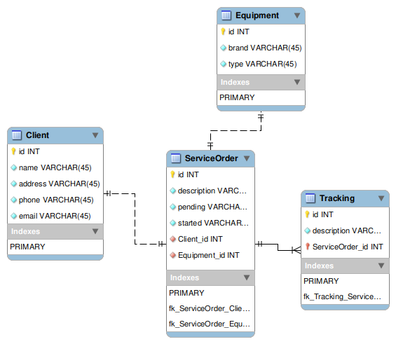

# Sistema de Controle de Manutenção de Equipamentos

Este projeto é uma API REST para um sistema de controle de manutenção de equipamentos. Inclui endpoints para gerenciar clientes, equipamentos, ordens de serviço e acompanhamentos de ordens de serviço.

## Tabela de Conteúdos

1. [Modelos e DTOs](#modelos-e-dtos)
2. [Controladores](#controladores)
3. [Endpoints](#endpoints)
4. [Serviços e Repositórios](#serviços-e-repositórios)
5. [Testes Unitários](#testes-unitários)
6. [Dependências](#dependências)
7. [Requisitos](#requisitos)
8. [Instalação e Execução](#instalação-e-execução)
9. [Testes](#testes)
10. [Estrutura de Arquivos](#estrutura-de-arquivos)

## Modelos e DTOs



### Client

Modelo que representa um cliente no sistema. Contém os seguintes campos:
- **id** *(Long)*: Identificador único do cliente.
- **name** *(String)*: Nome do cliente.
- **address** *(String)*: Endereço do cliente.
- **phone** *(String)*: Telefone do cliente.
- **email** *(String)*: Email do cliente.

### Equipment

Modelo que representa um equipamento no sistema. Contém os seguintes campos:
- **id** *(Long)*: Identificador único do equipamento.
- **type** *(String)*: Tipo do equipamento.
- **brand** *(String)*: Marca do equipamento.

### ServiceOrder

Modelo que representa uma ordem de serviço no sistema. Contém os seguintes campos:
- **id** *(Long)*: Identificador único da ordem de serviço.
- **client** *(Client)*: Cliente associado à ordem de serviço.
- **equipment** *(Equipment)*: Equipamento associado à ordem de serviço.
- **description** *(String)*: Descrição da ordem de serviço.
- **pending** *(Boolean)*: Define se a ordem de serviço é pendente ou não.
- **started** *(Boolean)*: Define se a ordem de serviço já foi iniciada ou não.

### ServiceOrder (DTO)

Modelo DTO usado na transferência de dados que representa uma ordem de serviço no sistema. Contém os seguintes campos:
- **clientId** *(Long)*: Identificador único do cliente associado à ordem de serviço.
- **equipmentId** *(Long)*: Identificador único do equipamento associado à ordem de serviço.
- **description** *(String)*: Descrição da ordem de serviço.

### Tracking

Modelo que representa um acompanhamento de uma ordem de serviço. Contém os seguintes campos:
- **id**: Identificador único do acompanhamento.
- **serviceOrder**  *(ServiceOrder)*: Ordem de serviço associada.
- **description** *(String)*: Descrição do acompanhamento.

### Tracking (DTO)

Modelo DTO usado na transferência de dados que representa um acompanhamento de uma ordem de serviço. Contém os seguintes campos:
- **serviceOrderId**  *(Long)*:  Identificador único da ordem de serviço associada.
- **description** *(String)*: Descrição do acompanhamento.

## Controladores

### ClientController

Controlador responsável por gerenciar os clientes.

- **POST /client**: Criar um novo cliente.
- **GET /client/{id}**: Consultar um cliente por ID.

### EquipmentController

Controlador responsável por gerenciar os equipamentos.

- **POST /equipment**: Criar um novo equipamento.
- **GET /equipment/{id}**: Consultar um equipamento por ID.

### ServiceOrderController

Controlador responsável por gerenciar as ordens de serviço.

- **POST /service-order**: Criar uma nova ordem de serviço.
- **GET /service-order/pending**: Consultar ordens de serviço pendentes.
- **PUT /service-order/{id}/start**: Registrar início do atendimento de uma ordem de serviço.
- **PUT /service-order/{id}/complete**: Registrar término do atendimento de uma ordem de serviço.

### TrackingController

Controlador responsável por gerenciar os acompanhamentos de ordens de serviço.

- **POST /{serviceOrderId}/tracking**: Adicionar um acompanhamento a uma ordem de serviço.
- **GET /{serviceOrderId}/tracking**: Listar todos os acompanhamentos de uma ordem de serviço.

## Endpoints

### Clientes

- **POST /client**
  - Descrição: Criar um novo cliente.
  - Parâmetros: JSON contendo o campo `name`, `address`, `phone` e `email`.
  - Resposta: JSON do cliente criado.

- **GET /client/{id}**
  - Descrição: Consultar um cliente por ID.
  - Parâmetros: `id` do cliente na URL.
  - Resposta: JSON do cliente.

### Equipamentos

- **POST /equipment**
  - Descrição: Criar um novo equipamento.
  - Parâmetros: JSON contendo o campo `type` e `brand`.
  - Resposta: JSON do equipamento criado.

- **GET /equipment/{id}**
  - Descrição: Consultar um equipamento por ID.
  - Parâmetros: `id` do equipamento na URL.
  - Resposta: JSON do equipamento.

### Ordens de Serviço

- **POST /service-order**
  - Descrição: Criar uma nova ordem de serviço.
  - Parâmetros: JSON contendo os campos `clientId`, `equipmentId` e `description`.
  - Resposta: JSON da ordem de serviço criada.

- **GET /service-order/pending**
  - Descrição: Consultar ordens de serviço pendentes.
  - Resposta: Lista de ordens de serviço pendentes.

- **PUT /service-order/{id}/start**
  - Descrição: Registrar início do atendimento de uma ordem de serviço.
  - Parâmetros: `id` da ordem de serviço na URL.
  - Resposta: JSON da ordem de serviço atualizada.

- **PUT /service-order/{id}/complete**
  - Descrição: Registrar término do atendimento de uma ordem de serviço.
  - Parâmetros: `id` da ordem de serviço na URL.
  - Resposta: JSON da ordem de serviço atualizada.

### Acompanhamentos

- **POST /{serviceOrderId}/tracking**
  - Descrição: Adicionar um acompanhamento a uma ordem de serviço.
  - Parâmetros: `serviceOrderId` da ordem de serviço na URL e JSON contendo o campo `description`.
  - Resposta: JSON do acompanhamento criado.

- **GET /{serviceOrderId}/tracking**
  - Descrição: Listar todos os acompanhamentos de uma ordem de serviço.
  - Parâmetros: `serviceOrderId` da ordem de serviço na URL.
  - Resposta: Lista de acompanhamentos.

## Serviços e Repositórios

### ClientService

Serviço responsável pelas operações relacionadas aos clientes.

### EquipmentService

Serviço responsável pelas operações relacionadas aos equipamentos.

### ServiceOrderService

Serviço responsável pelas operações relacionadas às ordens de serviço.

### TrackingService

Serviço responsável pelas operações relacionadas aos acompanhamentos.

### ClientRepository

Repositório para acesso aos dados dos clientes.

### EquipmentRepository

Repositório para acesso aos dados dos equipamentos.

### ServiceOrderRepository

Repositório para acesso aos dados das ordens de serviço.

### TrackingRepository

Repositório para acesso aos dados dos acompanhamentos.

## Testes Unitários

Os testes unitários foram criados para verificar a funcionalidade dos controladores e serviços.

### ClientControllerTest

Testa as operações do controlador de clientes.

### EquipmentControllerTest

Testa as operações do controlador de equipamentos.

### ServiceOrderControllerTest

Testa as operações do controlador de ordens de serviço.

### TrackingControllerTest

Testa as operações do controlador de acompanhamentos.

## Dependências

As seguintes dependências foram utilizadas no projeto:

- Spring Boot Starter Data JPA
- Spring Boot Starter Web
- H2 Database
- Spring Boot Starter Test
- Mockito

## Requisitos

Para rodar o projeto, é necessário ter instalado:

- Java 17
- Maven

## Instalação e Execução

1. Clone o repositório do projeto.
2. Navegue até o diretório do projeto.
3. Execute o comando `mvn clean install` para instalar as dependências.
4. Execute o comando `mvn spring-boot:run` para iniciar a aplicação.

## Testes

Para rodar os testes, execute o comando `mvn test`.

## Estrutura de Arquivos
```
src
├── main
│ ├── java
│ │ └── rpinfo
│ │ └── challenge
│ │ └── rpinfo_project
│ │ │ ├── controllers
│ │ │ │ ├── ClientController.java
│ │ │ │ ├── EquipmentController.java
│ │ │ │ ├── ServiceOrderController.java
│ │ │ │ └── TrackingController.java
│ │ │ ├── models
│ │ │ │ ├── Client.java
│ │ │ │ ├── Equipment.java
│ │ │ │ ├── ServiceOrder.java
│ │ │ │ └── Tracking.java
│ │ │ ├── repositories
│ │ │ │ ├── ClientRepository.java
│ │ │ │ ├── EquipmentRepository.java
│ │ │ │ ├── ServiceOrderRepository.java
│ │ │ │ └── TrackingRepository.java
│ │ │ ├── services
│ │ │ │ ├── ClientService.java
│ │ │ │ ├── EquipmentService.java
│ │ │ │ ├── ServiceOrderService.java
│ │ │ │ └── TrackingService.java
│ │ └── RpinfoProjectApplication.java
│ └── resources
│ ├── application.properties
│ └── data.sql
└── test
│└── java
││└── rpinfo
│││└── challenge
││││└── rpinfo_project
│││││├── controllers
││││││ ├── ClientControllerTest.java
││││││ ├── EquipmentControllerTest.java
││││││ ├── ServiceOrderControllerTest.java
││││││ └── TrackingControllerTest.java
```

#### Leonardo Zanotti